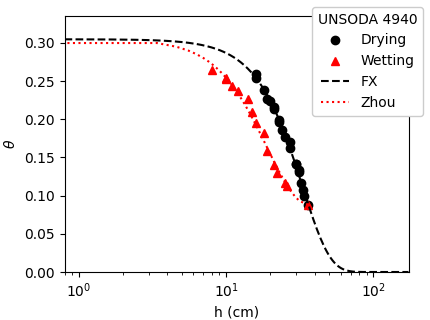

# Example

## Zhou's paper
As illustrated below, curves similar to those in Figure 6 of [Zhou (2013)](https://doi.org/10.1016/j.compgeo.2012.10.004) can be reproduced using [this Python code](https://github.com/sekika/hystfit/blob/main/docs/zhou/zhou-2013-fig6.py), with the same parameter set applied in each figure. This demonstrates that the `hystfit` tool effectively implements the algorithm proposed by Zhou (click to enlarge).

[](zhou/zhou-2013-fig6.png)

As illustrated in these figures, a larger advancing contact angle (&gamma;<sub>A</sub>)—depicted in the upper figures—results in a greater deviation between the main wetting and drying curves. Conversely, a larger value of 'b' (shown in the right figures) causes a slower transition from the main drying curve to the main wetting curve, and vice versa.

The sample code utilizes [matplotlib](https://matplotlib.org/) for rendering these figures. For further details, refer to the matplotlib documentation. The `smooth_theta` method in the `hystfit` class is used to draw smooth curves. For instance, executing the following code:
```python
theta = f.smooth_theta((0.3, 0.7, 0.55, 0.9, 0.8))
```
results in a numpy array named 'theta', which begins at 0.3, gradually increases to 0.7, then decreases to 0.55, and continues similarly. The code:
```python
h = f.h(p, theta)
```
calculates 'h' from this theta value.

## UNSODA dataset
This program utilized the [UNSODA dataset](https://doi.org/10.15482/USDA.ADC/1173246) and produced 15 figures, with full data links available through the [UNSODA viewer](https://sekika.github.io/unsoda/). The model exhibits an **excellent fit for sand** in these figures, particularly for disturbed samples; see samples [1410](#1410), [2310](#2310), [4890](#4890), [4940](#4940) and [4941](#4941).

**Method:** The [Python code](https://github.com/sekika/hystfit/blob/main/docs/unsoda/unsoda.py) used to generate the figures is provided. Laboratory drying curves were fitted using either the VG or FX model, depending on which had the lower corrected AIC. &theta;<sub>s</sub> is fixed when measured and optimized otherwise. &theta;<sub>r</sub> is set to 0. Laboratory wetting curves were fitted using the Zhou model. The saturated point may be omitted when fitting the wetting curve. In some cases, &theta;<sub>s</sub> was altered in the wetting curve, as documented. Data points where h = 0 cm are displayed as h = 1 cm in the figures.

### <a name="1270"></a>UNSODA 1270 Tuffaceous Rock (undisturbed)
- [Full data](https://sekika.github.io/unsoda/?1270)
- Rasmussen et al., Unsaturated Fractured Rock Characterization Methods and Data Sets at the Apache Leap Tuff Site, NUREG/CR-5596.
- FX: a = 3.22e+02 m = 0.463 n = 1.516  R<sup>2</sup> = 0.9950
- Zhou: cos&gamma;<sub>A</sub> = 0.749 b = 0.50 R<sup>2</sup> = 0.887

### <a name="1410"></a>UNSODA 1410 sand (disturbed)
- [Full data](https://sekika.github.io/unsoda/?1410)
- Shen and Jaynes, J. Hydr. Eng. (China) 10:11-20.
- FX: a = 22.1 m = 0.841 n = 12.259  R<sup>2</sup> = 0.9985
- Zhou: cos&gamma;<sub>A</sub> = 0.541 b = 1.00 R<sup>2</sup> = 0.865

### <a name="2020"></a>UNSODA 2020 silty clay loam (undisturbed)
- [Full data](https://sekika.github.io/unsoda/?2020)
- Ahuja and El-Swaify, 1975. Hydrologic Characteristics of Benchmark Soils of Hawaii's Forest Watersheds. Univ. of Hawaii.
- FX: a = 10.9 m = 0.127 n = 1.701  R<sup>2</sup> = 0.9966
- Zhou: cos&gamma;<sub>A</sub> = 0.328 b = 0.40 R<sup>2</sup> = 0.963
- &theta;<sub>s</sub> = 0.684 for drying and &theta;<sub>s</sub> = 0.711 for wetting

### <a name="2022"></a>UNSODA 2022 silty clay loam (undisturbed)
- [Full data](https://sekika.github.io/unsoda/?2022)
- Ahuja and El-Swaify, 1975. Hydrologic Characteristics of Benchmark Soils of Hawaii's Forest Watersheds. Univ. of Hawaii.
- FX: a = 11.5 m = 0.080 n = 2.888  R<sup>2</sup> = 0.9969
- Zhou: cos&gamma;<sub>A</sub> = 0.029 b = 0.50 R<sup>2</sup> = 0.906
- &theta;<sub>s</sub> = 0.671 for drying and &theta;<sub>s</sub> = 0.711 for wetting

### <a name="2310"></a>UNSODA 2310 sand (disturbed)
- [Full data](https://sekika.github.io/unsoda/?2310)
- Stauffer and Dracos, 1986. J. Hydrol. 84:9-34.
- FX: a = 37.4 m = 0.889 n = 16.851  R<sup>2</sup> = 0.9987
- Zhou: cos&gamma;<sub>A</sub> = 0.145 b = 1.00 R<sup>2</sup> = 0.965
- &theta;<sub>s</sub> = 0.348 for drying and &theta;<sub>s</sub> = 0.296 for wetting

### <a name="3340"></a>UNSODA 3340 sand (undisturbed)
- [Full data](https://sekika.github.io/unsoda/?3340)
- FX: &theta;<sub>s</sub> = 0.311 a = 20.3 m = 0.762 n = 4.790  R<sup>2</sup> = 0.9925
- Zhou: cos&gamma;<sub>A</sub> = 0.359 b = 1.00 R<sup>2</sup> = 0.718

### <a name="4700"></a>UNSODA 4700 silty clay loam (disturbed)
- [Full data](https://sekika.github.io/unsoda/?4700)
- Moore, R.E., Hilgardia 12(6):383-427, 1939
- FX: &theta;<sub>s</sub> = 0.322 a = 54.8 m = 0.199 n = 7.935  R<sup>2</sup> = 0.9980
- Zhou: cos&gamma;<sub>A</sub> = 0.276 b = 0.87 R<sup>2</sup> = 0.64
- &theta;<sub>s</sub> = 0.322 for drying and &theta;<sub>s</sub> = 0.396 for wetting

### <a name="4710"></a>UNSODA 4710 loam (disturbed)
- [Full data](https://sekika.github.io/unsoda/?4710)
- Moore, R.E., Hilgardia 12(6):383-427, 1939
- FX: &theta;<sub>s</sub> = 0.364 a = 38.5 m = 0.710 n = 2.772  R<sup>2</sup> = 0.9973
- Zhou: cos&gamma;<sub>A</sub> = 0.503 b = 1.00 R<sup>2</sup> = 0.891
- &theta;<sub>s</sub> = 0.364 for drying and &theta;<sub>s</sub> = 0.406 for wetting

### <a name="4890"></a>UNSODA 4890 sand (disturbed)
- [Full data](https://sekika.github.io/unsoda/?4890)
- Bull. IASH XI No.1:69-110. 1966
- FX: a = 1.17e+02 m = 0.858 n = 6.542  R<sup>2</sup> = 0.9962
- Zhou: cos&gamma;<sub>A</sub> = 0.393 b = 1.00 R<sup>2</sup> = 0.951
- &theta;<sub>s</sub> = 0.298 for drying and &theta;<sub>s</sub> = 0.301 for wetting

### <a name="4910"></a>UNSODA 4910 loam (disturbed)
- [Full data](https://sekika.github.io/unsoda/?4910)
- Elrick and Bowman, 1964. Soil Sci. Soc. Am. Proc. 28:450-452
- FX: &theta;<sub>s</sub> = 0.520 a = 59.7 m = 0.416 n = 2.244  R<sup>2</sup> = 0.9956
- Zhou: cos&gamma;<sub>A</sub> = 0.000 b = 0.79 R<sup>2</sup> = 0.998

### <a name="4920"></a>UNSODA 4920 silt loam (undisturbed)
- [Full data](https://sekika.github.io/unsoda/?4920)
- Green, et al., 1964. Soil Sci. Soc. Am. Proc. 28:15-19
- FX: &theta;<sub>s</sub> = 0.539 a = 1.3e+02 m = 0.672 n = 1.433  R<sup>2</sup> = 0.9995
- Zhou: cos&gamma;<sub>A</sub> = 0.000 b = 0.98 R<sup>2</sup> = 0.814

### <a name="4922"></a>UNSODA 4922 silt loam (undisturbed)
- [Full data](https://sekika.github.io/unsoda/?4922)
- Green, et al., 1964. Soil Sci. Soc. Am. Proc. 28:15-19
- FX: &theta;<sub>s</sub> = 0.521 a = 77.3 m = 0.678 n = 1.550  R<sup>2</sup> = 0.9995
- Zhou: cos&gamma;<sub>A</sub> = 0.104 b = 1.00 R<sup>2</sup> = 0.781

### <a name="4923"></a>UNSODA 4923 silt loam (undisturbed)
- [Full data](https://sekika.github.io/unsoda/?4923)
- Green, et al., 1964. Soil Sci. Soc. Am. Proc. 28:15-19
- FX: &theta;<sub>s</sub> = 0.521 a = 77.3 m = 0.678 n = 1.550  R<sup>2</sup> = 0.9995
- Zhou: cos&gamma;<sub>A</sub> = 0.104 b = 1.00 R<sup>2</sup> = 0.781

### <a name="4940"></a>UNSODA 4940 sand (disturbed)
- [Full data](https://sekika.github.io/unsoda/?4940)
- Poulovassilis, 1970. Soil Science 109(1):5-12
- FX: &theta;<sub>s</sub> = 0.305 a = 6.23e+02 m = 2678.129 n = 2.345  R<sup>2</sup> = 0.9952
- Zhou: cos&gamma;<sub>A</sub> = 0.586 b = 1.00 R<sup>2</sup> = 0.992

### <a name="4941"></a>UNSODA 4941 sand (disturbed)
- [Full data](https://sekika.github.io/unsoda/?4941)
- Poulovassilis, 1970. Soil Science 109(1):5-12
- VG: &theta;<sub>s</sub> = 0.275 &alpha; = 0.0339 n = 4.84 R<sup>2</sup> = 0.9963
- Zhou: cos&gamma;<sub>A</sub> = 0.438 b = 1.00 R<sup>2</sup> = 0.957

