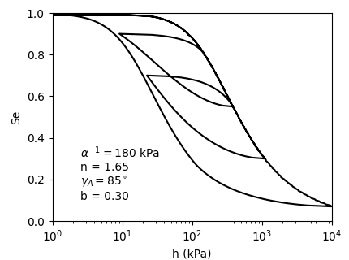
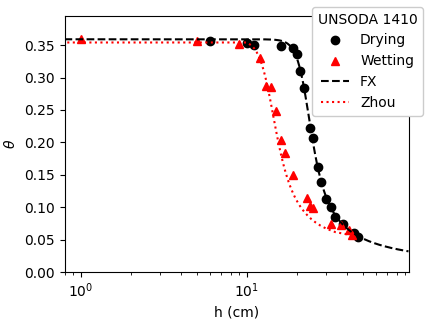
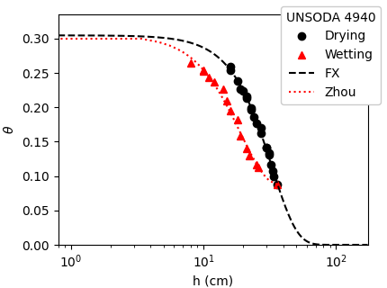

# hystfit
`hystfit` is a Python library designed to calculate the soil water retention curve (SWRC) with hysteresis, building upon the model proposed by Zhou (2013). It extends the functionality of [unsatfit](https://sekika.github.io/unsatfit/).

Although Zhou's model is complex, `hystfit` simplifies the plotting of SWRCs that incorporate hysteresis and aids in parameter optimization. Once parameters are determined, it enables the calculation of changes in pressure head based on changes in water content.

## Document
Please follow the [instruction](instruction.md).

## Example output
Here are some figures calculated using `hystfit`. For more detailed information, please refer to the [example documentation](example.md), which provides sample codes for generating these figures.

## Reference
- Zhou, A. (2013). A contact angle-dependent hysteresis model for soil–water retention behaviour. Computers and Geotechnics, 49, 36-42. [https://doi.org/10.1016/j.compgeo.2012.10.004](https://doi.org/10.1016/j.compgeo.2012.10.004) ([Researchgate](https://www.researchgate.net/publication/237008163_A_contact_angle-dependent_hysteresis_model_for_soil-water_retention_behaviour))
